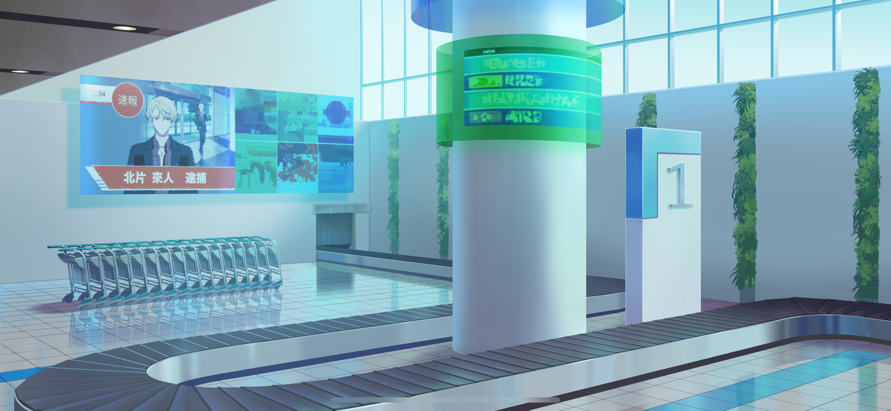
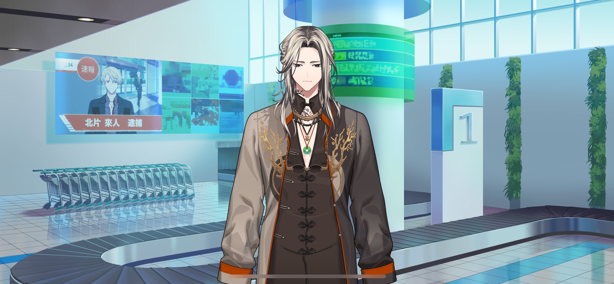
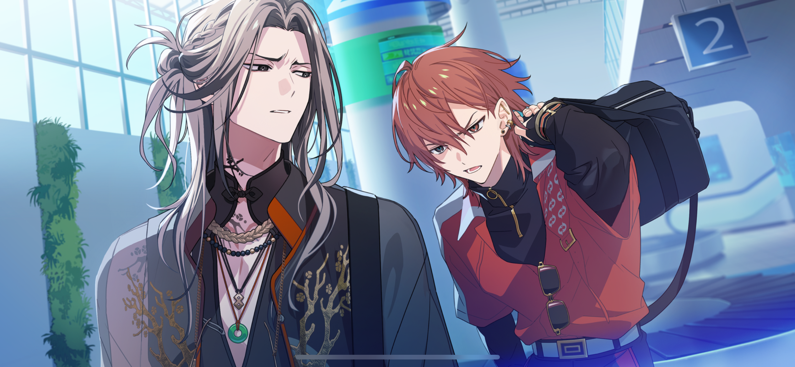
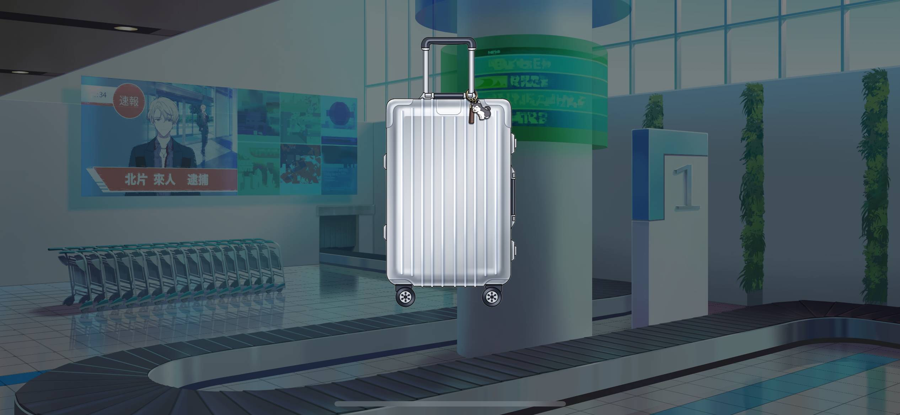
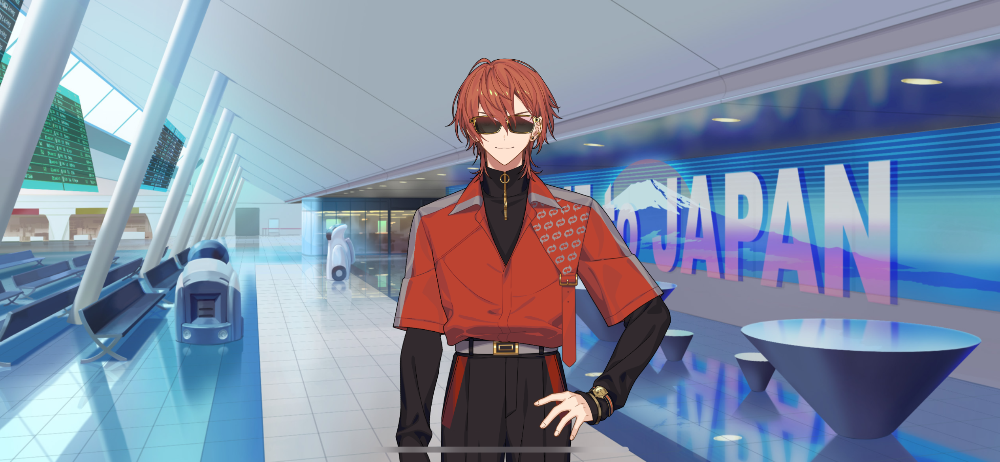
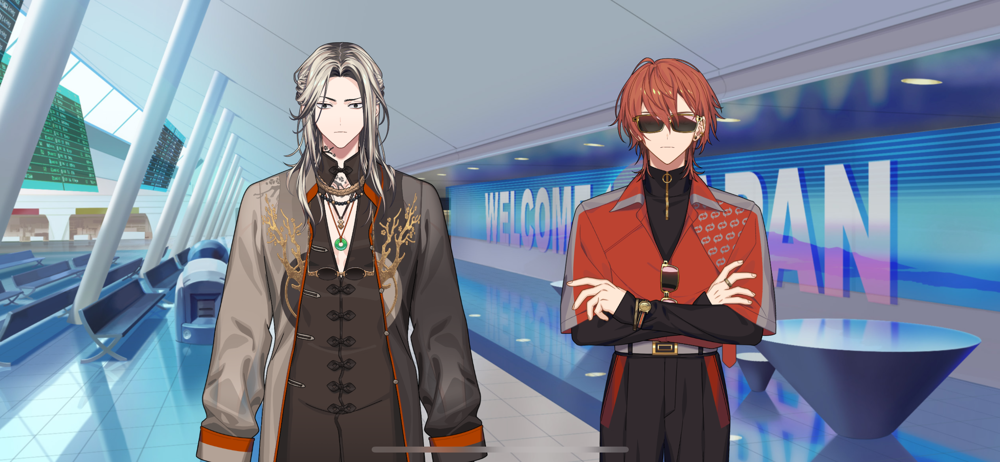

import "styles/series/18tr.scss";
import Bubble from "components/tl/Bubble.astro";
import Box from "components/tl/Box.astro";
import Location from "components/tl/Location.astro";
import Diff from "components/tl/Diff.astro";

<Location name="Tokyo Metropolis International Airport - Baggage Claim"/>

<Box type="radio">
Suspect Kitakata Raito has been arrested on charges of aggravated assault. Kitakata is an entrepreneur well known for starting the metaverse service known as “mahorava…”
</Box>

<Bubble character="MC">
Phew… We finally landed.

(I like traveling, but it feels so nice to be back home.)

(Well, it’s not all sunshine and rainbows now that I’m here, seeing as how I’m gonna be unemployed in a week…)

(Bump) Ah…
</Bubble>

<Bubble character="Liguang" name="Man with Long Hair">
Excuse me.
</Bubble>

<Bubble character="MC">
I’m sorry. I wasn’t paying attention…
</Bubble>

<Bubble character="Liguang" name="Man with Long Hair">
I’m sorry, too. You’re not hurt?
</Bubble>

<Bubble character="MC">
No, I’m okay. Are you…?
</Bubble>

<Bubble character="Liguang" name="Man with Long Hair">
Yeah, I’m fine. Thanks.
</Bubble>

<Bubble character="MC">
(He looked kind of familiar…)

(Bump) Woah…!
</Bubble>

<Bubble character="Renga" name="Man with Red Hair">
Slow down! Who said you could walk in front of me?!
</Bubble>

<Bubble character="Liguang" name="Man with Long Hair">
……
</Bubble>

<Bubble character="Renga" name="Man with Red Hair">
Hey! Did I stutter?! Don’t make me say it again!
</Bubble>

<Bubble character="Liguang" name="Man with Long Hair">
…Rudeness doesn’t deserve a response. I shouldn’t have to explain that to you.
</Bubble>

<Bubble character="Renga" name="Man with Red Hair">
You son of a…!

Oh, there’s my luggage. Move!
</Bubble>

<Bubble character="MC">
(I should get my suitcase too. How long is it gonna take? What time was my bus again…?)
</Bubble>

<Bubble character="Liguang" name="Man with Long Hair">
Hey…Don’t cut in front of me. Out of the way.
</Bubble>

<Bubble character="Renga" name="Man with Red Hair">
Shut it, dumbass! Don’t get in my way! We both know my suitcase is gonna come out first.
</Bubble>

<Bubble character="Liguang" name="Man with Long Hair">
Bèndàn… Where do you get all that baseless confidence from?
</Bubble>

<Bubble character="Renga" name="Man with Red Hair">
Just wait, I’ll prove you wrong! My bag is gonna come out–
</Bubble>

<Bubble character="Liguang" name="Man with Long Hair">
That’s mine.
</Bubble>

<Bubble character="Renga" name="Man with Red Hair">
Wuh?!
</Bubble>

<Bubble character="Liguang" name="Man with Long Hair">
Hmph…
</Bubble>

<Bubble character="Renga" name="Man with Red Hair">
Damn you… Hey, Li–
</Bubble>

(Alarms sounding)

<Bubble character="Liguang" name="Man with Long Hair">
…Hm?
</Bubble>

<Bubble character="Security Robot">
Stop. Stop.
</Bubble>

<Bubble character="Liguang" name="Man with Long Hair">
What?
</Bubble>

<Bubble character="Security Robot">
Please open your luggage and step away. A search will be conducted.
</Bubble>

(Alarms sounding)

<Bubble character="Liguang" name="Man with Long Hair">
……
</Bubble>

<Bubble character="Security Robot">
Commencing search.
</Bubble>

(Alarms sounding)

<Bubble character="Security Robot">
Unidentified pills found. Color: green. Enclosed in transparent package. One bag.
</Bubble>

<Bubble character="Liguang" name="Man with Long Hair">
Those are…!
</Bubble>

<Bubble character="Security Robot">
We ask for your cooperation to confirm the details.
</Bubble>

<Bubble character="Liguang" name="Man with Long Hair">
…Those are rabbit pellets.
</Bubble>

<Bubble character="MC">
(Pellets…? He has a pet rabbit?)
</Bubble>

<Bubble character="Renga" name="Man with Red Hair">
Haha! Go ahead and take your sweet time! I told you I’d be first out!
</Bubble>

<Bubble character="Liguang" name="Man with Long Hair">
Tch…
</Bubble>

<Bubble character="MC">
(They were at each other's throats in the plane too. They keep arguing about, uh… kind of childish things, though.)

Oh, there’s my suitcase.

Hup… Oof.

(Oh, I should put my carry-on inside.)

(My passcode was… Hm…?)

…Huh?
</Bubble>

<Bubble character="MC">
A little doggy keychain? This isn’t mine… Did I take someone else’s bag?!
</Bubble>

<Location name="Tokyo Metropolis International Airport - Lobby"/>

<Bubble character="Renga" name="Man with Red Hair">
Phew, finally home… Wasn’t an easy flight.

Oh, crap… Almost forgot.
</Bubble>

<Bubble character="Renga" name="Man with Red Hair">
Heh…

(As long as I got these on, the only people who can recognize me are my superfans.)

…Alright. Clothes, check. Hair, check. Gotta keep it classy.

(A Nishizono’s gotta look his best.)

Let’s roll–
</Bubble>

<Bubble character="MC">
Excuse me!
</Bubble>

<Bubble character="Renga" name="Man with Red Hair">
Eep?!
</Bubble>

<Bubble character="MC">
Excuse me! Can I talk to you? You in the sunglasses!
</Bubble>

<Bubble character="Renga" name="Man with Red Hair">
<Diff g="m">Wh… A-A fan? If he makes a fuss here… No, wait, I got this. We’re staying classy…</Diff>
<Diff g="f">Wh… A-A fan? If she makes a fuss here… No, wait, I got this. We’re staying classy…</Diff>
</Bubble>

<Bubble character="MC">
Um, that suitcase is…!
</Bubble>

<Bubble character="Renga" name="Man with Red Hair">
Ahem… Sorry to say, but I’m on a private schedule.
</Bubble>

<Bubble character="MC">
What? No wait, I just need the suitcase…
</Bubble>

<Bubble character="Renga" name="Man with Red Hair">
<Diff g="m">(He’s still going… I really gotta pull out the big guns against these crazy types of fans.)</Diff>
<Diff g="f">(She’s still going… I really gotta pull out the big guns against these crazy types of fans.)</Diff>

(Activating my Secret Technique: Paparazzi-Evading Speedwalk!)
</Bubble>

<Bubble character="MC">
Wait! Hold on!
</Bubble>

<Bubble character="Renga" name="Man with Red Hair">
H-hey…!

Let go! Back up, commoner!
</Bubble>

<Bubble character="MC">
C-commoner…?!
</Bubble>

<Bubble character="Renga" name="Man with Red Hair">
Who gave a commoner like you the permission to touch an A-list celebrity?!
</Bubble>

<Bubble character="MC">
No, I mean, I just…

(Wait… Is he…?)
</Bubble>

<Bubble character="Woman A">
Wait, is that Renga…?
</Bubble>

<Bubble character="Woman B">
No way, what’s he doing here?!
</Bubble>

<Bubble character="MC">
(I was right… He’s Nishizono Renga, the famous model who’s the mayor of one of the HAMA wards… He runs Ward 3, right?)

(Oh, and…)

(I think that other man was a mayor, too. What was his name, Lu Liguang…?)

(I guess they know each other because they’re both ward mayors. They didn’t seem to like each other very much, though…)
</Bubble>

<Bubble character="Woman A">
Do I talk to him? Do I?!
</Bubble>

<Bubble character="Woman B">
Uh, who’s that person next to him?
</Bubble>

<Bubble character="Renga">
Shit, now everything’s a mess…

Hey, you! You’re the one who caused all this! What’s your problem?!
</Bubble>

<Bubble character="MC">
No, I just wanted to tell you about my suitcase…
</Bubble>

<Bubble character="Renga">
Sh-shut it! I’m getting out of here!
</Bubble>

<Bubble character="Woman A">
Aah! I want Renga to yell at me too!
</Bubble>

<Bubble character="Woman B">
I’m so jealous!
</Bubble>

<Bubble character="Woman A">
Rengaaaaa!!
</Bubble>

<Bubble character="MC">
Huh?! Wait…!
</Bubble>

<Bubble character="Onlooker A">
What? What’s happening?
</Bubble>

<Bubble character="Onlooker B">
Renga’s here? As in, Nishizono Renga, the model?
</Bubble>

<Bubble character="Renga">
Hey, back off! Can’t you see I got sunglasses on?! That means I’m on a private schedule!!
</Bubble>

<Bubble character="Old Man">
Look at alla these people… You reckon everyone’s here linin’ up for them souvenirs?
</Bubble>

<Bubble character="Old Woman">
My, it’s so crowded… City folk really have it different.
</Bubble>

<Bubble character="MC">
(O-oh no… Everyone’s crowding around us.)
</Bubble>

<Bubble character="Renga">
I told you all to step back!! Back the hell up!!
</Bubble>

<Bubble character="Woman A">
Aah! Renga yelled at me!
</Bubble>

<Bubble character="Onlooker B">
Wow, Nishizono Renga’s kind of an asshole.
</Bubble>

<Bubble character="Old Man">
This line ain’t movin’ at all. Cashiers these days can’t even get the job done right.
</Bubble>

<Bubble character="MC">
(This isn’t good. Things aren’t calming down.)
</Bubble>

<Bubble character="Kotonojo" name="Girl (?)">
(Sigh) What a dreadful sight. He calls himself a mayor when he can’t even offer any proper hospitality…

No wonder HAMA is doomed to fail.

How boring. Let’s go.
</Bubble>

<Bubble character="MC">
(People are even badmouthing HAMA…! I can’t let my hometown’s reputation go down like this…)
</Bubble>

<Bubble character="Renga">
Gahhhh fuck!! What the hell do I do now?!
</Bubble>

<Bubble character="MC">
Wait, please just hear me out!!
</Bubble>

<Bubble character="Renga">
What do you want…!
</Bubble>

<Bubble character="MC">
I can help you!
</Bubble>

<Bubble character="Renga">
Huh?! You want to help…?
</Bubble>

<Bubble character="Liguang">
…What’s happening here?
</Bubble>

<Bubble character="MC">
Ah, perfect timing! Can you help us, too?
</Bubble>

<Bubble character="Liguang">
Help? With what exactly…
</Bubble>

<Bubble character="MC">
Help with… offering hospitality!
</Bubble>
