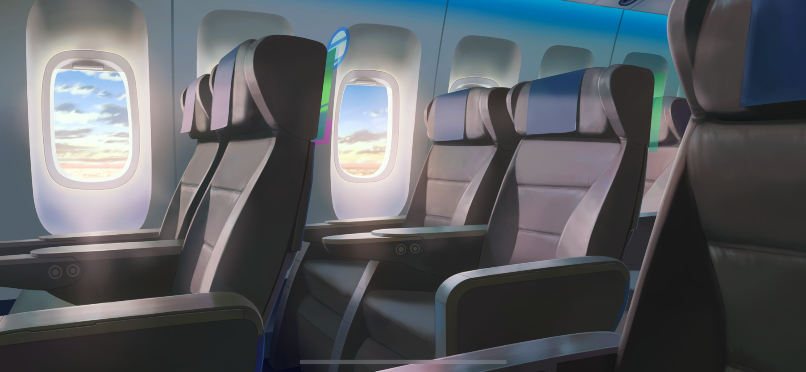
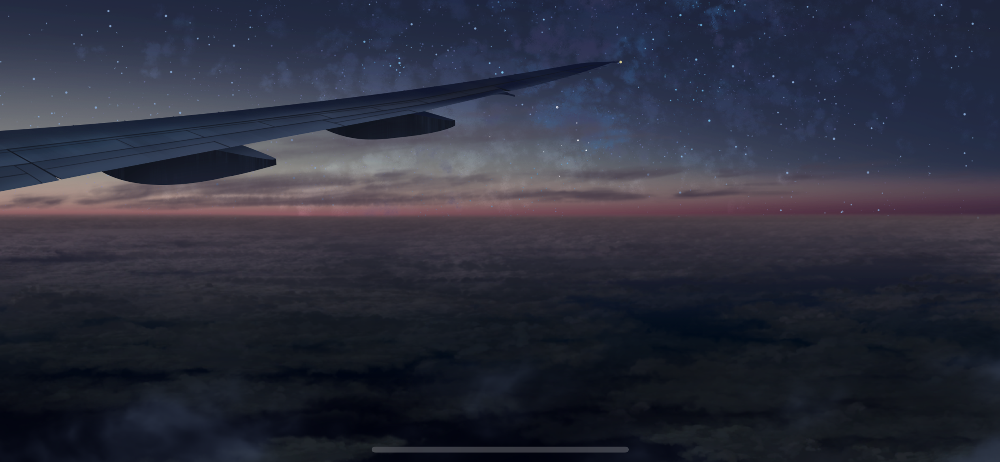
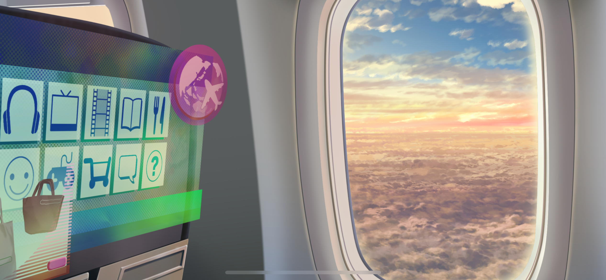
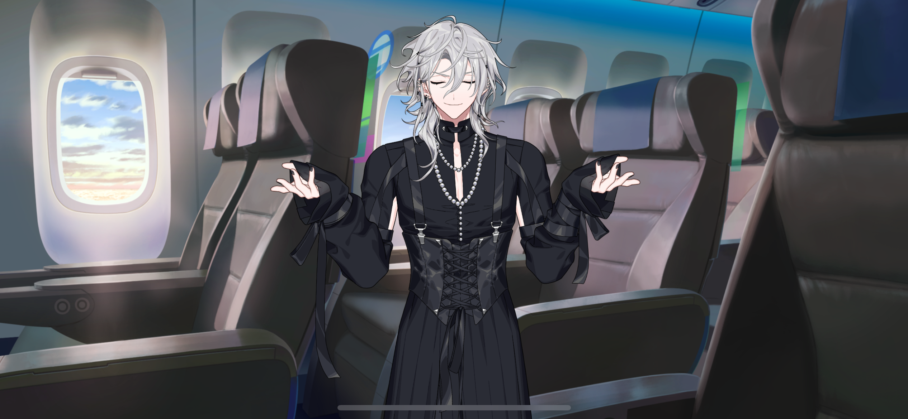

import "styles/series/18tr.scss";
import Bubble from "@/components/tl/Bubble/Bubble.astro";
import Box from "components/tl/Box.astro";
import Narration from "components/tl/Narration";
import Location from "components/tl/Location.astro";
import Diff from "components/tl/Diff.astro";

<Location name="Plane"/>

<Box type="radio">
Please have your arrival card filled out in preparation for our landing.
</Box>

<Box type="radio">
We hope you enjoy the rest of your flight until we arrive.
</Box>

<Narration>
The memories of a trip are like a cassette tape.

On the A-side are all the fun experiences, and on the B-side…are the tough times that you’ll inevitably have to face. Neither side can exist without the other.

…But even those rough patches are things to love about travel.
</Narration>

<Box type="radio">
We will soon be arriving at Tokyo Metropolis International Airport.
</Box>

<Bubble mc>
…I can’t wait to see you again, Kafka.
</Bubble>

<Bubble character="Kuguri" name="Seatmate">
Are you recording something with that? Those things haven’t been around in over five decades.
</Bubble>

<Bubble mc>
Oh, yeah. It’s a cassette tape.

I think they were used a lot around the end of the 20th century…up until the 90s.
</Bubble>

<Bubble character="Kuguri" name="Seatmate">
I’ve heard they’ve been getting popular again lately. People call it “ret,” I think… I’ve been seeing that word around a lot. Are you a fan of ret things?
</Bubble>

<Bubble mc>
I mean, I'm not super into it… but I do really like cassettes.
</Bubble>

<Bubble character="Renga" unknown>
Hey! …Don’t…move already!
</Bubble>

<Bubble character="Liguang" unknown>
…plane with you…bad mood…stand and wait…piss me off.
</Bubble>

<Bubble character="Renga" unknown>
HUH?! I’m…bad mood!
</Bubble>

<Bubble mc>
(What’s going on… Are they arguing?)
</Bubble>

<Bubble character="Kuguri" name="Seatmate">
Good grief… They’re putting on quite the show.

<Diff g="m">
But it seems like I was able to have a wonderful flight sitting next to you. Thank you dearly, _fiú._
</Diff>
<Diff g="f">
But it seems like I was able to have a wonderful flight sitting next to you. Thank you dearly, _lány._
</Diff>
</Bubble>

<Bubble mc>
Oh, no, not at all… The pleasure’s all mine!
</Bubble>

<Bubble character="Kuguri" name="Seatmate">
Are you coming home to JPN from somewhere?
</Bubble>

<Bubble mc>
Yeah, I’m going back to my hometown. I live in HAMA-18.
</Bubble>
