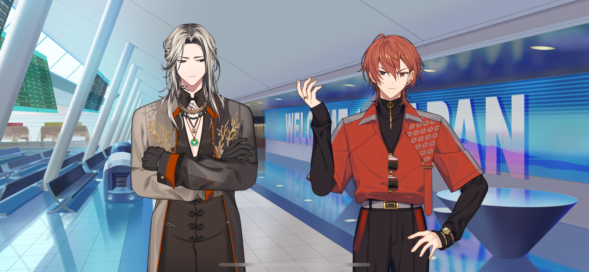
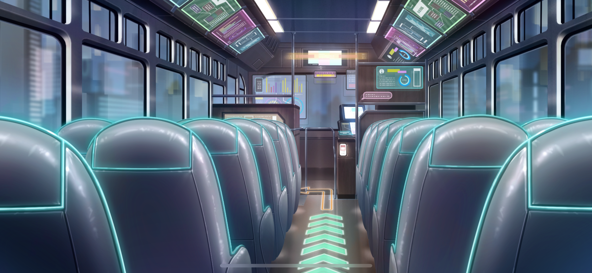
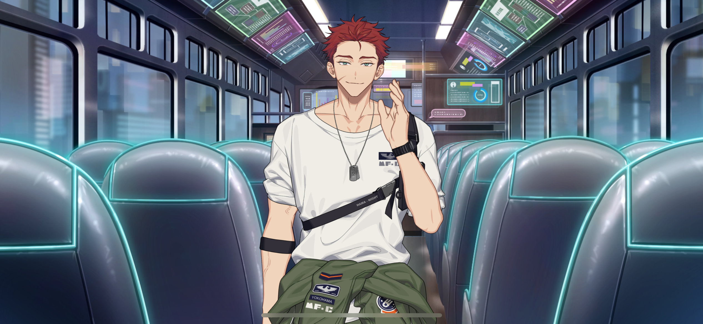

import "styles/series/18tr.scss";
import Bubble from "components/tl/Bubble.astro";
import Box from "components/tl/Box.astro";
import Location from "components/tl/Location.astro";

<Location name="Tokyo Metropolis International Airport - Lobby"/>

<Bubble character="MC">
Phew… We did it.
</Bubble>

<Bubble character="Liguang">
Dragging me into your mess and making me clean it up… Unbelievable.
</Bubble>

<Bubble character="Renga">
I didn’t ask for your help!
</Bubble>

<Bubble character="MC">
(I convinced Liguang to help us out somehow… I’m lucky that there were two ward mayors around to handle things.)

Um, thank you so much for the help…!
</Bubble>

<Bubble character="Liguang">
Hmph… This was a waste of my time.
</Bubble>

<Bubble character="Renga">
Who cares about your time when it was a waste of mine!

Dammit, slow down, Liguang! I told you not to walk in front—
</Bubble>

<Bubble character="MC">
Hold on!
</Bubble>

<Bubble character="Renga">
Huh?! What else do you want?!
</Bubble>

<Bubble character="MC">
No, my suitcase…!
</Bubble>

<Bubble character="Renga">
What do you want with my… Huh? Why do you have the same one…?
</Bubble>

<Bubble character="MC">
The one you have is mine.
</Bubble>

<Bubble character="Renga">
Ah…! It doesn’t have my Pup Pup Paradise charm on it…!

D-Dammit! Why didn’t you tell me earlier?! I can’t be caught owning the same things as a commoner!
</Bubble>

<Bubble character="MC">
(He keeps calling me that…)

(Sigh…) He’s gone. At least I got my luggage back.

(I don’t care that much about what’s inside it, but I just don’t wanna lose the suitcase since it was a gift.)
</Bubble>

<Box type="radio">
The final bus bound for HAMA is about to depart. All passengers please make your way to bus stop 11.
</Box>

<Bubble character="MC">
Oh no… I need to run!
</Bubble>

<Location name="Bus"/>

<Bubble character="MC">
Phew… I made it.
</Bubble>

<Box type="radio">
The bus will now depart. All passengers, please fasten your seatbelts.”
</Box>

<Bubble character="MC">
(But still…)

(This bus is so empty. I guess it is the last one of the day… but there used to be so many more people on here.)
</Bubble>

<Bubble character="Daniel" unknown>
Oh? Hamasaki, is that you?
</Bubble>

<Bubble character="MC">
Huh… Daniel-san?!
</Bubble>

<Bubble character="Daniel">
Yo, nice to see ya.
</Bubble>

<Bubble character="MC">
Same here. Are you heading the same way?
</Bubble>

<Bubble character="Daniel">
Yeah. Crazy that buses to HAMA only run once every four hours. Waiting for this one tired me out more than the flight.
</Bubble>

<Bubble character="MC">
Ah, yeah… It would really suck if you missed it. The Tokyo one runs about as often as Yamanote line trains, lucky them.
</Bubble>

<Bubble character="Daniel">
Yeah, I’m not surprised, honestly. We both know what’s going on with the HAMA recession from first-hand experience.

Want some beer? The unemployed gotta stick together, you get me?
</Bubble>

<Bubble character="MC">
You know… We’re not technically unemployed for another week.

(Daniel-san and I both worked as tour guides at the same travel agency, but… Unfortunately, our company declared bankruptcy.)
</Bubble>

<Bubble character="Daniel">
Well, at least we can toast to our final day on the clock.
</Bubble>

<Bubble character="MC">
(Our final day… Yeah, both of us flew in today after giving our final tours with the company.)

Daniel-san… What are you thinking of doing after the company goes down?
</Bubble>

<Bubble character="Daniel">
Man, don’t get my mood down right at the end like that…
</Bubble>

<Bubble character="MC">
Come on, the company won’t even end for another week.
</Bubble>

<Bubble character="Daniel">
Hahaha! Well, y’know, I’ll figure it out.

What about you? Got anything lined up?
</Bubble>

<Bubble character="MC">
I…

(Being a tour guide was fun, and I really like traveling too. Plus…)

(Back in the airport… Well, it was a different kind of situation than what I would be in at my job, but… it made me happy that I was able to help out HAMA a bit.)

(…I know I want to stay in the tourism industry. But doing work overseas always leaves me with a lasting regret in the back of my mind.)

(…So what is it that I really want to do?)
</Bubble>

<Bubble character="Daniel">
Hey, what’s up? Something on your mind?
</Bubble>

<Bubble character="MC">
No, I’m good… I’ll try and figure things out, too.
</Bubble>

<Bubble character="Daniel">
Haha! That’s the spirit. We’ll just go wherever the wind takes us, right?
</Bubble>

<Bubble character="MC">
Uh, no. Unlike you, I would prefer to think things through.
</Bubble>

<Bubble character="Daniel">
That so? Well… Then I guess this just marks the end of one journey and the start of another.
</Bubble>

<Bubble character="MC">
Yeah… You’re right. That’s a good way of putting it.
</Bubble>

<Bubble character="Daniel">
But, hey, keep your head in the game up until next week, and it’ll make things easier on me.
</Bubble>

<Bubble character="MC">
…I have tomorrow off, you know.
</Bubble>

<Bubble character="Daniel">
Whaaat? Naaaah, come on, let’s do this together.
</Bubble>

<Bubble character="MC">
Good luck at work.

(I get to see Kafka again tomorrow.)

(After that, I need to look for my next job… I know I’ll find something. I’ll find something that lets me do what I’ve always wanted to do. Just thinking about it makes me excited.)

(I can’t wait to see who I’ll meet on my journey!)
</Bubble>
