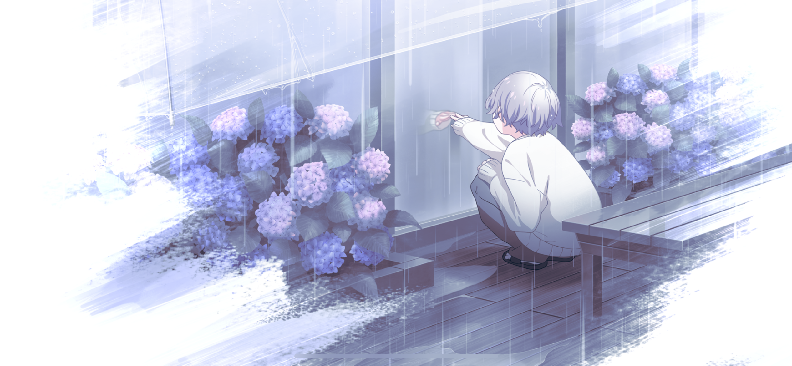
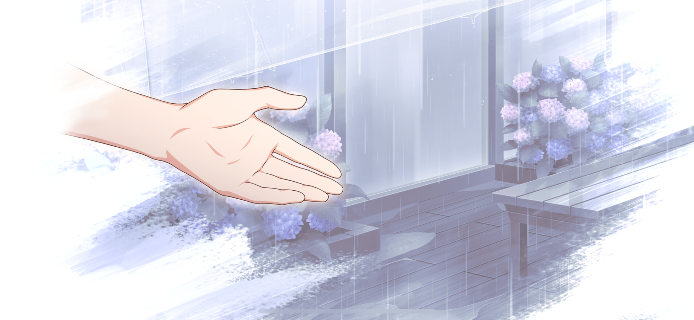
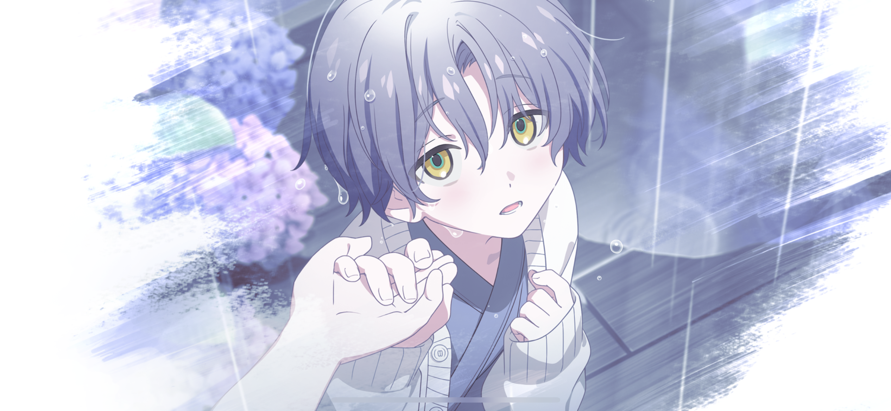
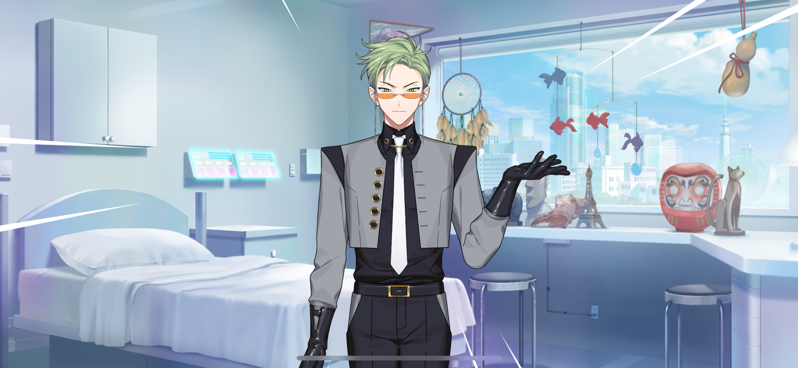
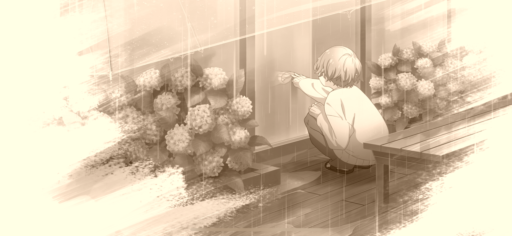
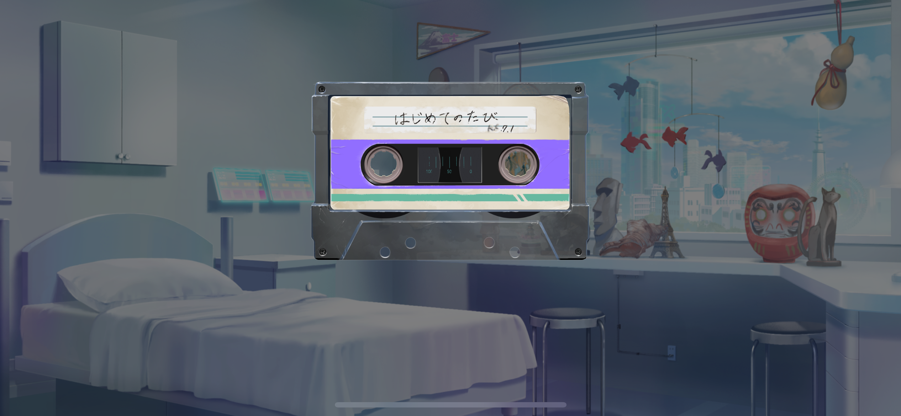

import "styles/series/18tr.scss";
import Bubble from "components/tl/Bubble";
import Location from "components/tl/Location.astro";
import Flashback from "components/tl/Flashback.astro";
import Diff from "components/tl/Diff.astro";
import Phone from "components/tl/Phone.astro";

<Flashback start />

<Bubble character="MC">
You’ll catch a cold if we stay out here.
</Bubble>

<Bubble character="Kafka" name="Boy in Hospital Clothing">
……
</Bubble>

<Bubble character="MC">
Come on, Kafka… Let’s go back inside.
</Bubble>

<Bubble character="Kafka">
…I don’t wanna.
</Bubble>

<Bubble character="MC">
But… I don’t want you to get sick!
</Bubble>

<Bubble character="Kafka">
…This is all I have. All I have is… the hospital rooftop or the courtyard.

That’s it… It takes everything I have just to go this far.
</Bubble>

<Bubble character="MC">
Kafka…

But you know! When you get that surgery, you can go to so many more places!

Once you get better, you can go anywhere… We can go on fun trips and play together.
</Bubble>

<Bubble character="Kafka">
The surgery success rate isn't 100%.
</Bubble>

<Bubble character="MC">
Does that mean… it might fail?
</Bubble>

<Bubble character="Kafka">
…Either way, I can’t even get surgery until I get older.
</Bubble>

<Bubble character="MC">
Kafka…
</Bubble>

<Bubble character="Kafka">
I’m so jealous of you, MC-chan. You can go as far as you want, to anywhere you want…
</Bubble>

<Bubble character="MC">
…Kafka. Let’s go on a trip together after the rain stops. Together.
</Bubble>

<Bubble character="Kafka">
You want me to go with you?
</Bubble>

<Bubble character="MC">
Yeah. Just the two of us.
</Bubble>

<Bubble character="Kafka">
…MC-chan.
</Bubble>

<Bubble character="MC">
Hm?
</Bubble>

<Bubble character="Kafka">
Don’t let go of my hand, okay? Tell me you won’t let go…
</Bubble>

<Bubble character="MC">
I won’t.
</Bubble>

<Bubble character="Kafka">
I mean it, okay? Even when… Even when they do my surgery…
</Bubble>

<Bubble character="MC">
I won’t ever let go. Never ever.
</Bubble>

<Bubble character="Kafka">
Promise?
</Bubble>

<Bubble character="MC">
I promise!
</Bubble>

<Flashback end />

<Location name="Oguro Hospital - Hallway"/>

<Bubble character="MC">
…I still remember that day.
</Bubble>

<Phone to="Kafka Oguro">

    
Surgery’s done

    
WHAT?!

    
YOUR SURGERY? IT’S DONE?? WHAT???

    
Sorry, everything happened so suddenly I didn’t have time to tell you

    
How did it go?

    
Kafka?

    
Are you okay?

    
HELLO?

</Phone>

<Bubble character="MC">
He’s not responding…

I guess I can assume that the surgery went well if Kafka himself is letting me know.

(But I can’t be sure until I see him in person!)
</Bubble>

<Location name="Oguro Hospital - Room"/>

<Bubble character="MC">
Kaf—
</Bubble>

<Bubble character="Sakujiro" name="Man with Thin Glasses">
DON’T MOVE!!!! Stop right there!
</Bubble>

<Bubble character="MC">
Uwaa?!
</Bubble>

<Bubble character="Sakujiro" name="Man with Thin Glasses">
You mustn’t enter this room. It is said that many unsolved cases may or may not be the unfortunate result of overlooking evidence from the initial investigation.
</Bubble>

<Bubble character="MC">
(Wait, it’s just Kafka’s butler…)

Sakujiro-san? What do you mean… It’s just Kafka’s hospital room…

Did… Did something happen to Kafka…?!
</Bubble>

<Bubble character="Sakujiro">
That is currently under investigation. I am terribly sorry, but I would prefer you stay there for the time being.
</Bubble>

<Bubble character="MC">
Uh… Okay?
</Bubble>

<Bubble character="Sakujiro">
I’m afraid I have no choice. Much like Icarus flying too close to the sun, we must not rely on artificial intelligence in excess, lest we risk the destruction of the human race. I did not want to stoop to this level, however…
</Bubble>

<Bubble character="MC">
Is that another one of your weird gadgets?
</Bubble>

<Bubble character="Sakujiro">
Indubitably! This is the 777th gadget passed down through the Oguro family’s lineage of butlers.

…This is precisely what we need. The Young Master Kafka scent detector, “Sniffy-Licky-Puppy!”

It is a robot dog that keeps daily records of Young Master Kafka’s scent and uses the data to analyze the changes in his blood components to offer insight on what he’s been doing, what he’s been eating, even what he’s been hiding from us.
</Bubble>

<Bubble character="MC">
Does it do the… licky thing too?
</Bubble>

<Bubble character="Sakujiro">
It does not do the licky thing. That is my job, at least in my heart.

This will conduct the search for us with the press of a button.

Hm, it has picked something up! Young Master Kafka rose up out of his bed 36 minutes and 31 seconds ago and promptly changed out of his pajamas into day clothes.
</Bubble>

<Bubble character="MC">
Yeah, I can see his pajamas on the floor over here!
</Bubble>

<Bubble character="Sakujiro">
It seems as though he proceeded to turn around and consume one piece of chewing gum. Indeed, the bottle seems to be missing one piece compared to when I checked this morning.
</Bubble>

<Bubble character="MC">
You can figure out that one’s missing just by the weight? Wow…

(It’s kind of crazy how much he knows about Kafka…)
</Bubble>

<Bubble character="Sakujiro">
Young Master Kafka then put his hand on the door, and glanced right, left, and right once again out into the hallway to check for passersby.

Ahh, this is the exact method I taught him for crossing the street when he was a young boy.
</Bubble>

<Bubble character="MC">
So Kafka was checking to make sure nobody would catch him leaving…?
</Bubble>

<Bubble character="Sakujiro">
According to Sniffy-Licky-Puppy, Young Master Kafka’s emotions at the time were half excitement and half nervousness!

And at last, he takes a step out of his hospital room, starting on his right foot…!
</Bubble>

<Bubble character="MC">
…(Gulp)…
</Bubble>

<Bubble character="Sakujiro">
……
</Bubble>

<Bubble character="MC">
But where did he go…?
</Bubble>

<Bubble character="Sakujiro">
That I do not know. Regrettably, Sniffy-Licky-Puppy cannot tell us that much.
</Bubble>

<Bubble character="MC">
What? No…! It told us everything except the most important part?!
</Bubble>

<Bubble character="Sakujiro">
However, we may safely assume that the best course of action is to find Young Master Kafka and bring him back posthaste.
</Bubble>

<Bubble character="MC">
But we don’t know where he went… He shouldn’t be walking around outside right after having surgery…
</Bubble>

<Bubble character="Sakujiro">
…Hm?
</Bubble>

<Bubble character="MC">
He told me that they finished his surgery.
</Bubble>

<Bubble character="Sakujiro">
…Yes, that is true.

MC-san, if I may ask for your help. It seems as though…

He left this letter, no… this tape for you.
</Bubble>

<Bubble character="MC">
A cassette tape? And you’re sure this is Kafka’s?
</Bubble>

<Bubble character="Sakujiro">
Yes, it was left under his sheets.
</Bubble>

<Bubble character="MC">
Oh, the date written on it…

(It’s from 10 years ago, so it must be…)
</Bubble>

<Bubble character="MC">
Let’s go on a trip together after the rain stops. Together.
</Bubble>

<Bubble character="Kafka">
You want me to go with you?
</Bubble>

<Bubble character="MC">
Yeah. Just the two of us.
</Bubble>

<Bubble character="MC">
It’s from back then…
</Bubble>
