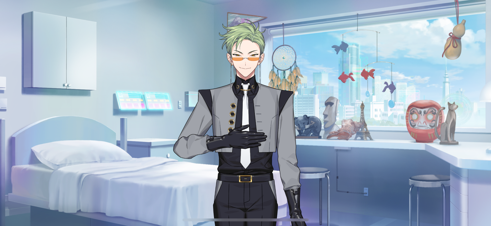
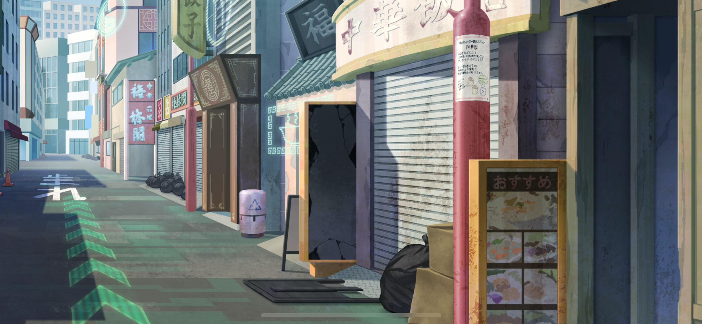
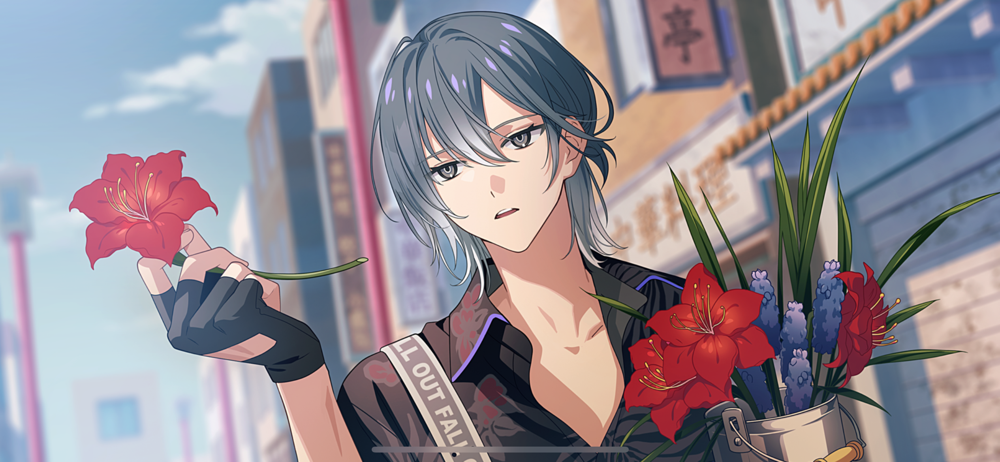
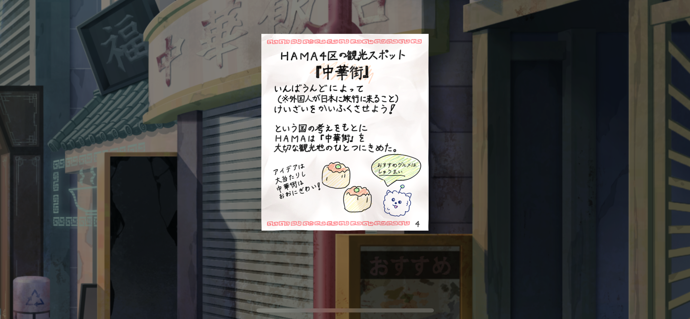
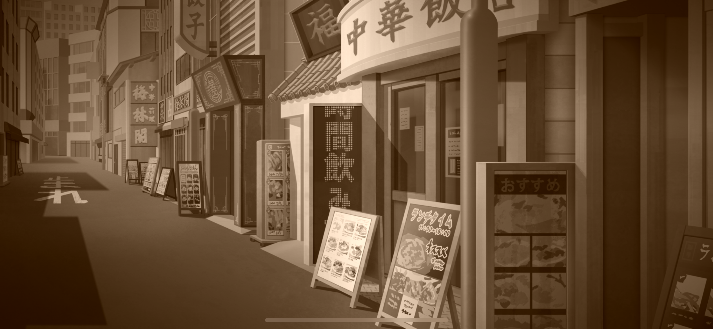
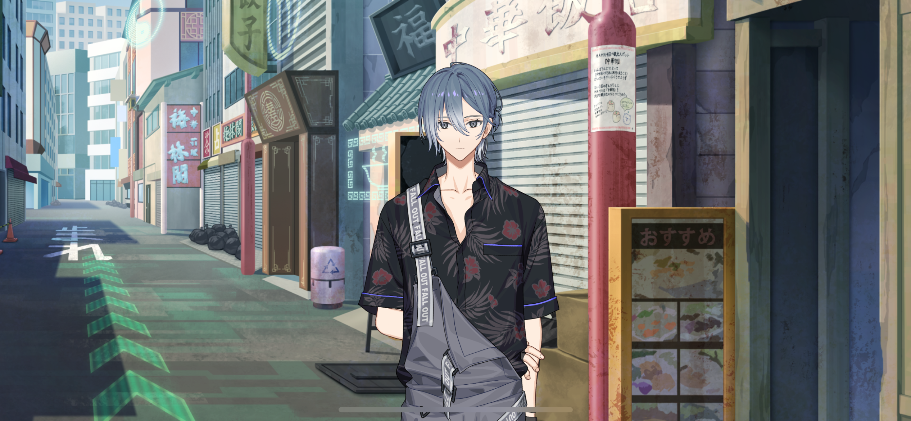

import "@/styles/series/18tr.scss";
import Bubble from "@/components/tl/chapter/Bubble/Bubble.astro";
import Box from "@/components/tl/chapter/Box.astro";
import Narration from "@/components/tl/chapter/Narration";
import Location from "@/components/tl/chapter/Location.astro";
import Flashback from "@/components/tl/chapter/Flashback.astro";
import Diff from "@/components/tl/chapter/Diff.astro";
import Name from "@/components/tl/chapter/Name.astro";

{/* <Narration> */}
<Diff g="m">
July 1st. I snuck out of the hospital today. I’m going on my first trip… <Name first />-chan is taking me, like he promised.

I’m so excited… I wonder if <Name first />-chan can tell when he holds my hand. That’s all I can think about.
</Diff>
<Diff g="f">
July 1st. I snuck out of the hospital today. I’m going on my first trip… <Name first />-chan is taking me, like she promised.

I’m so excited… I wonder if <Name first />-chan can tell when she holds my hand. That’s all I can think about.
</Diff>

I’ll never forget this day for the rest of my life. Everything I saw, everything I ate, everybody I met… All the smells, the sounds, the colors… And I’ll never forget how warm <Name first />-chan’s hand was.

Going on a trip can make you feel so many things.

So I’ve decided. One day… As HAMA Ward 0 mayor, I’ll make sure everyone who visits gets the best hospitality ever.
{/* </Narration> */}

<Location name="Oguro Hospital - Room"/>

<Bubble mc>
I knew it… It’s a recording from the day I helped Kafka sneak out of the hospital and we explored HAMA together.

(Kafka… This day really meant a lot to him.)
</Bubble>

<Bubble character="Sakujiro">
“One day as mayor…” I expect nothing less from the heir of the current HAMA ward 0 mayor… What grand ambitions from such a young age.

But I digress. We must commence the search for Young Master Kafka immediately. I propose we go our separate ways for maximum efficiency.
</Bubble>

<Bubble mc>
Yeah, that makes sense. I’ll head out, then…
</Bubble>

<Location name="Chinatown - Alleyway"/>

<Bubble mc>
(I don’t think Kafka left the cassette there for no reason.)

(I thought I could start by following the route I laid out for our trip back then, but…)

I didn’t really think it through when I made it, so it goes all over the place. I hope I can find him sooner rather than later… (Bump)
</Bubble>

<Bubble character="Delinquent in Extremely Cropped Jacket">
Woah, there! You got a problem with me or somethin’?
</Bubble>

<Bubble mc>
Oh, excuse me.
</Bubble>

<Bubble character="Delinquent in Dangerously Saggy Pants">
Whazzat?! You almost pushed my bud over and that’s all he gets?! Is douchebaggery a HAMA thing or what?!
</Bubble>

<Bubble mc>
No, I…

(This is bad… Are places around here starting to become delinquent hang outs because they’re run down now?)
</Bubble>

<Bubble character="Delinquent in Dangerously Saggy Pants">
It took two whole hours for us to come down here to bum-fuck-ass HAMA, y’know!
</Bubble>

<Bubble character="Delinquent in Extremely Cropped Jacket">
Came out here lookin’ for a good fight, y’know what I’m sayin’?!
</Bubble>

<Bubble character="Delinquents">
Gahahaha!
</Bubble>

<Bubble mc>
Looking to fight? But why here…?
</Bubble>

<Bubble character="Delinquent in Extremely Cropped Jacket">
‘Cuz everywhere else got those cop bots chasin’ us out, duh. Keep up with the times, y’old geezer.

‘Cuz everywhere else got those cop bots chasin’ us out, duh. Keep up with the times, y’old hag.
</Bubble>

<Bubble character="Delinquent in Dangerously Saggy Pants">
But since the bots ain’t in HAMA, my buddy over here runs this place!
</Bubble>

<Bubble mc>
(I can’t believe this…)
</Bubble>

<Bubble character="Delinquent in Extremely Cropped Jacket">
So you gonna cough it up or what? You went outta your way to bump into me, so hand it over.
</Bubble>

<Bubble character="Delinquent in Dangerously Saggy Pants">
Pay damages, yeah?
</Bubble>

<Bubble character="Delinquent in Extremely Cropped Jacket">
I ain’t got all day, shithead.
</Bubble>

<Bubble character="Delinquent in Dangerously Saggy Pants">
Cops ain’t gonna help in civil cases, pisshead.
</Bubble>

<Bubble mc>
Uh… I don’t have any money on me…
</Bubble>

<Bubble character="Delinquent in Extremely Cropped Jacket">
Ay, don’t be such a tightwad! If you don’t got cash, I’ll be nice and let you pay digitally.
</Bubble>

<Bubble mc>
No, I still…
</Bubble>

<Bubble character="Nagi" name="Florist">
Excuse me… Would you like some flowers?
</Bubble>

<Bubble character="Delinquent in Extremely Cropped Jacket">
HUH?!
</Bubble>

<Bubble character="Delinquent in Dangerously Saggy Pants">
Who the hell are you?
</Bubble>

<Bubble character="Nagi" name="Florist">
You can pay digitally, if you’d like.
</Bubble>

<Bubble character="Delinquent in Extremely Cropped Jacket">
Wh… You tryna start something, dickwad?!
</Bubble>

<Bubble character="Nagi" name="Florist">
Do you have any favorite flowers? Or a favorite color… Oh, if you don’t, I can pick out some that match with your favorite words in flower language.
</Bubble>

<Bubble character="Delinquent in Dangerously Saggy Pants">
Flower language?! The fuck are you talkin’ about?!
</Bubble>

<Bubble character="Nagi" name="Florist">
Let me see… I can recommend one…

Here, how about some amaryllises?
</Bubble>

<Bubble character="Delinquent in Extremely Cropped Jacket">
I don’t need that shit!
</Bubble>

<Bubble character="Nagi" name="Florist">
Oh, I see… Well, then…

What about grape hyacinths?
</Bubble>

<Bubble character="Delinquent in Dangerously Saggy Pants">
We said we don’t want any of your damn flowers! Are you dumb?! 
</Bubble>

<Bubble character="Nagi" name="Florist">
Oh… Well, I guess I have to hand over my prized possession…
</Bubble>

<Bubble mc>
(He’s taking something out of his pocket… Is that… horsetail…?!)
</Bubble>

<Bubble character="Delinquent in Extremely Cropped Jacket">
Wh— A piece of grass? The hell…
</Bubble>

<Bubble character="Nagi" name="Florist">
I harvested it to use for dinner tonight, but you can have it. I got it for free, so no need to pay me back.
</Bubble>

<Bubble character="Delinquent in Dangerously Saggy Pants">
The fuck are you…
</Bubble>

<Bubble character="Delinquent in Extremely Cropped Jacket">
L-Let’s just go.
</Bubble>

<Bubble character="Delinquent in Dangerously Saggy Pants">
Yeah, let’s get outta here.
</Bubble>

<Bubble character="Nagi" name="Florist">
HAMA nice trip.
</Bubble>

<Bubble mc>
(Wow… He got them to leave with just some horsetail… Wait…)

Uh, what did you just say…?
</Bubble>

<Bubble character="Nagi" name="Florist">
Hm? Which part?
</Bubble>

<Bubble mc>
The… “HAMA nice trip” thing?
</Bubble>

<Bubble character="Nagi" name="Florist">
Oh, yeah. It’s something I came up with. Kind of like a greeting to people who come to visit HAMA.

It’s not really catching on, though. But you can use it too, if you like it.
</Bubble>

<Bubble mc>
Oh, thank you… Yeah, it’s nice.

Oh, and also! Thank you for helping me out!
</Bubble>

<Bubble character="Nagi" name="Florist">
I didn’t really do anything crazy. It’s about to rain anyway.
</Bubble>

<Bubble mc>
It is? How do you…

Huh? Wait…

No way… It’s a page from the travel guide I made for Kafka when we were kids. It’s just a copy, but… What is it doing here?
</Bubble>

<Box type="paper">
This Chinatown was made to be a special tourist spot so HAMA could revive its economy through inbound tourism (visitors from other countries coming to Japan)!

The idea worked super well and Chinatown is always busy!
The shumai here is really good.
</Box>

<Bubble mc>
(…Now I remember. Back then was HAMA’s golden age, and everywhere was always crowded with people…)
</Bubble>

<Flashback start />

<Bubble character="Chinatown Resident A">
Oh, aren’t you two the cutest little customers! Did you come here by yourselves?
</Bubble>

<Bubble character="Chinatown Resident B">
Hey, you two! Wanna give this a try? Don’t worry about the money, just take a sample!
</Bubble>

<Bubble character="Chinatown Resident C">
Are you lost? Where are you trying to go? …Oh, that’s right by the station. I can take you there, follow me!
</Bubble>

<Bubble mc>
(Everybody here was so nice to us… I don’t think we got special treatment just because we were kids.)

(If you compare what it was like then to now…)
</Bubble>

<Flashback end />

<Bubble mc>
…Everything’s so different.
</Bubble>

<Bubble character="Nagi" name="Florist">
Uh… Are you okay?
</Bubble>

<Bubble mc>
Oh, sorry. I was just thinking about something.
</Bubble>

<Bubble character="Nagi" name="Florist">
Are you headed somewhere? If it's not too far, I can give you a ride on my motorcycle.
</Bubble>
