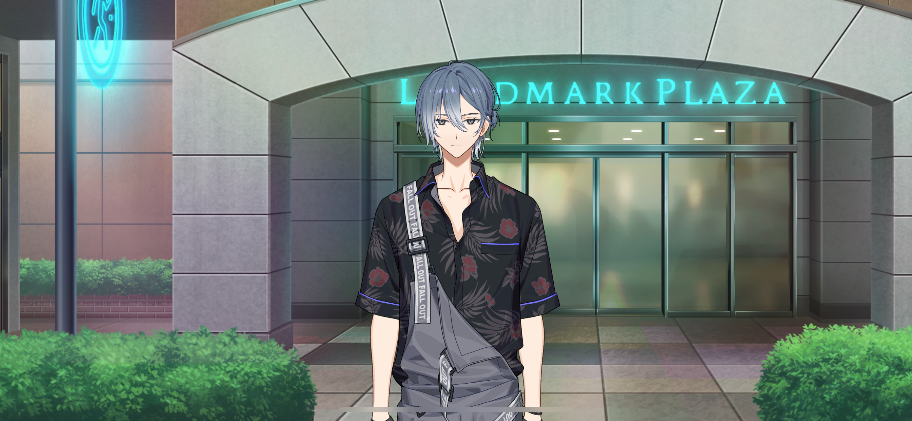
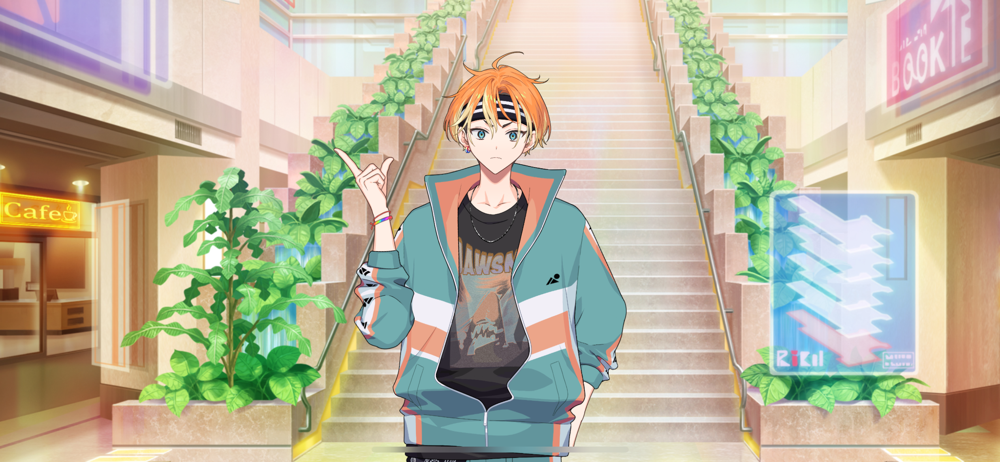
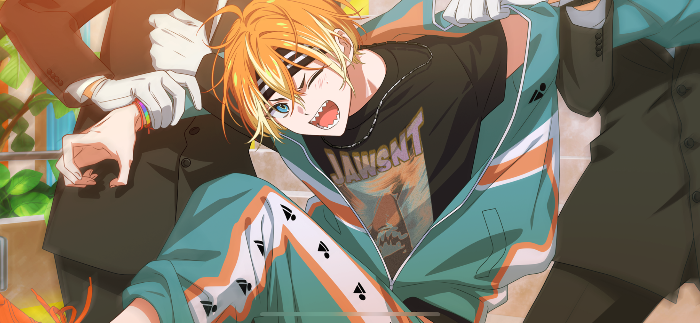
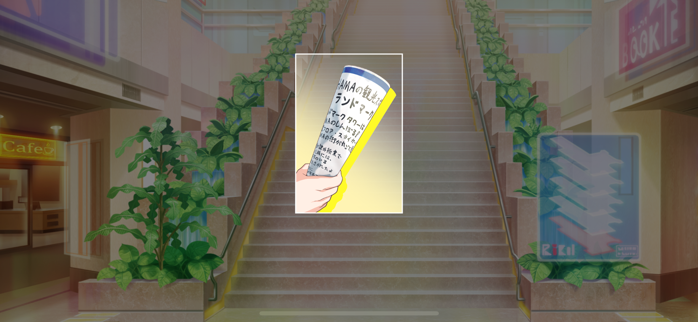
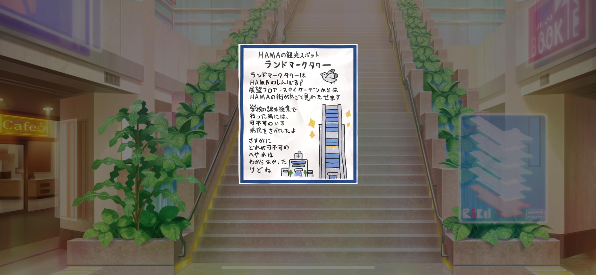
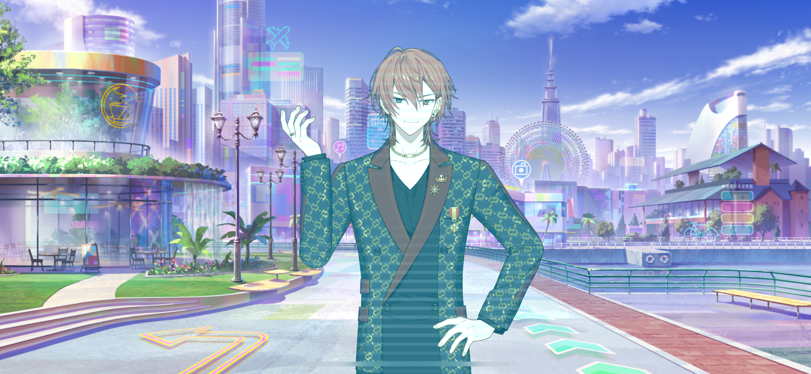

import "styles/series/18tr.scss";
import Bubble from "components/tl/Bubble";
import Box from "components/tl/Box.astro";
import Location from "components/tl/Location.astro";

<Location name="Landmark Plaza"/>

<Bubble character="Nagi" name="Florist">
Is this a good place to drop you off?
</Bubble>

<Bubble character="MC">
Yeah, here’s good! Thank you so much, uh…

Sorry, I never asked for your name.
</Bubble>

<Bubble character="Nagi" name="Florist">
Oh, uh… Just take this.
</Bubble>

<Bubble character="MC">
What’s this?
</Bubble>

<Bubble character="Nagi" name="Florist">
Card for my shop. Stop by when you have the time.

I always have flowers if you want some. You can come in if you have laundry to do, too.
</Bubble>

<Bubble character="MC">
Laundry? And flowers…? At the same place…?
</Bubble>

<Bubble character="Nagi" name="Florist">
See you, I gotta go.
</Bubble>

<Bubble character="MC">
Oh, thank you again!

…HAMA nice trip!
</Bubble>

<Bubble character="Nagi" name="Florist">
…HAMA nice trip, too.
</Bubble>

<Bubble character="MC">
(…He was interesting.)

Okay… I need to keep looking for Kafka!
</Bubble>

<Location name="Landmark Plaza - First Floor"/>

<Bubble character="MC">
Hmm… I don’t see him here.

(Where did you go, Kafka…)

If I can find the next page from that old travel guide…
</Bubble>

<Bubble character="Akuta" name="Boy with Headband">
Hey, you!
</Bubble>

<Bubble character="MC">
Huh… Me?
</Bubble>

<Bubble character="Akuta" name="Boy with Headband">
Yeah! Can you do me a huge favor?

Take this camera and get this shot of me!
</Bubble>

<Bubble character="MC">
Wh… Uh… Huh?!
</Bubble>

<Bubble character="Akuta" name="Boy with Headband">
A’ight, here we go…

“No, wait!!”
 {/* should be in big caps */}
</Bubble>

<Bubble character="MC">
Huh? What is he…
</Bubble>

<Bubble character="Akuta" name="Boy with Headband">
“You can’t go up those stairs yet! Nooooo!!”
</Bubble>

<Bubble character="Security Guard A">
Hey, hold it!
</Bubble>

<Bubble character="Akuta" name="Boy with Headband">
“Dammit… The space dimension overjourney device won’t finish charging at this rate…”
</Bubble>

<Bubble character="Security Guard B">
What are you talking about… Get away from the stairs! You’re not allowed up there if you don’t respect the dress code!
</Bubble>

<Bubble character="Akuta" name="Boy with Headband">
“I get it already! We won’t be able to withstand an incomplete overjourney with this equipment…!”

Hey, are you getting this? Get a good shot!
</Bubble>

<Bubble character="MC">
Wh… Is he talking to me…?
</Bubble>

<Bubble character="Akuta" name="Boy with Headband">
“Let me go! I can’t let him leave on his own!”
</Bubble>

<Bubble character="Security Guard A">
Wh…! This kid’s stronger than he looks…!
</Bubble>

<Bubble character="Security Guard B">
Calm down!!
</Bubble>

<Bubble character="Akuta" name="Boy with Headband">
Woah…?!
</Bubble>

<Bubble character="MC">
(Oh… They let him go…?)
</Bubble>

<Bubble character="Akuta" name="Boy with Headband">
Phew… Guess we’re done here.

Hey! Didja get that?! Didja?!
</Bubble>

<Bubble character="MC">
Uh… Sorry. I was kind of surprised, so I didn’t…
</Bubble>

<Bubble character="Akuta" name="Boy with Headband">
Man, reallyyy! We gotta do one more take, then…
</Bubble>

<Bubble character="MC">
No, wait! The security guards are gonna catch you again!
</Bubble>

<Bubble character="Akuta" name="Boy with Headband">
Well, yeah, that’s what I want! This is scene 87, where the main character shakes off the dudes trying to stop him and crosses the multiverse to go help his friend!
</Bubble>

<Bubble character="MC">
Uh, I don’t know what you’re filming here, but I think you should tone it down a little… The guards are already on edge as it is.
</Bubble>

<Bubble character="Akuta" name="Boy with Headband">
Aw, come on! I was this close to getting a super crazy emotional scene from that, you know!
</Bubble>

<Bubble character="MC">
…Huh?

What are you holding?
</Bubble>

<Bubble character="Akuta" name="Boy with Headband">
Oh, this? It’s just a bunch of rolled up paper but… It’s my megaphone! Every director needs one of these bad boys!
</Bubble>

<Bubble character="MC">
No, I mean the actual paper… The one on top. Can I look at it?
</Bubble>

<Bubble character="Akuta" name="Boy with Headband">
Yeah, sure! I just picked it up since it flew down from somewhere upstairs.
</Bubble>

<Box type="paper">
The Landmark Tower is the symbol of HAMA! If you go to the Sky Garden you can see all of HAMA from above.

I saw your hospital from there when I went for a school field trip once. But I couldn’t really tell which room was yours.
</Box>

<Bubble character="MC">
This is… Another page from my travel guide…
</Bubble>

<Bubble character="Akuta" name="Boy with Headband">
Woah, you went up there for a field trip? We don’t get to do that these days.
</Bubble>

<Bubble character="MC">
Huh, why not?
</Bubble>

<Bubble character="Akuta" name="Boy with Headband">
Well, like… Just look.
</Bubble>

<Bubble character="Renga">
“Located on the 2nd floor of the Landmark Plaza. Burger Emperor’s specialty dish, diamond fries—only 34,000 yen!”

“Cut from premium potatoes imported from Noirmoutier for 40,000 yen per kilogram, these fries are soaked in water straight from a source 450 meters under the Andes for exactly 38.8 seconds before being fried to perfection by a world-class chef!”
</Bubble>

<Bubble character="MC">
(Nishizono Renga… I met him at the airport yesterday! And 30,000 yen for some french fries?! Is this an ad for a 5-star burger restaurant?!)
</Bubble>

<Bubble character="Renga">
“Experience the top-of-the-line service you deserve. Bask in urban luxury here at Landmark, where we only offer the best of the best for the elite.”
</Bubble>

<Bubble character="Akuta" name="Boy with Headband">
You see? No way they’d let little kids run around a swanky place like this anymore.
</Bubble>

<Bubble character="MC">
No way…!

(Landmark has changed this much?! Did he plan all of this as mayor…?!)
</Bubble>
