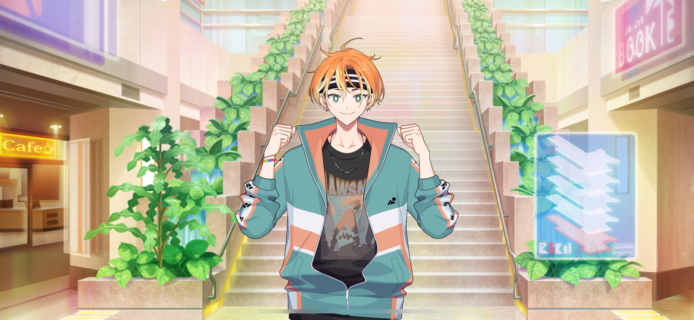
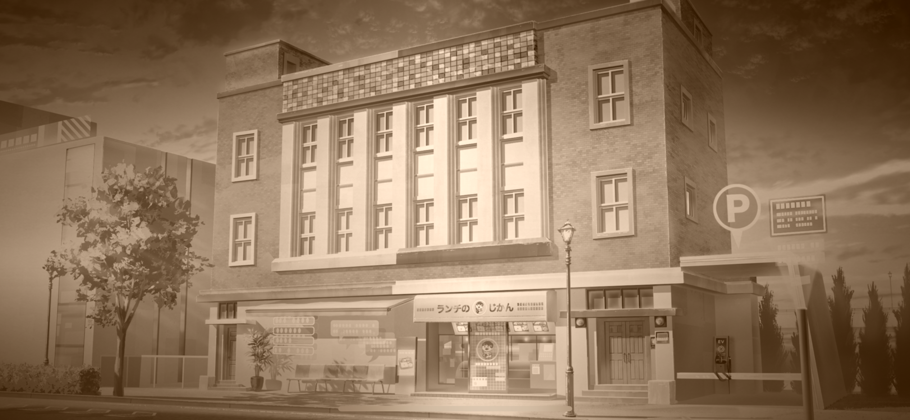
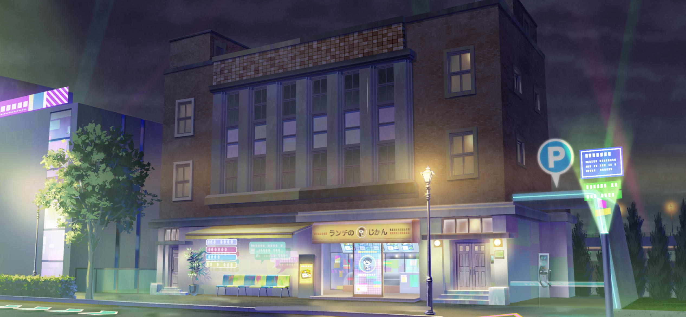
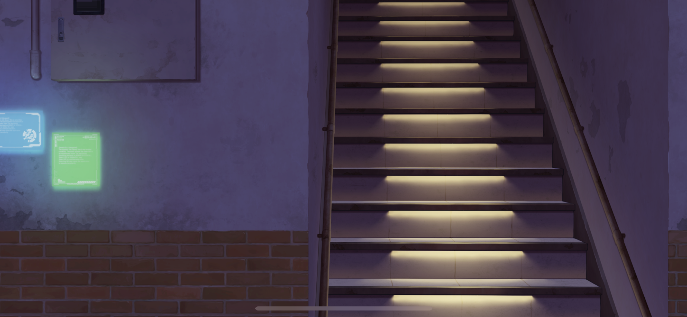
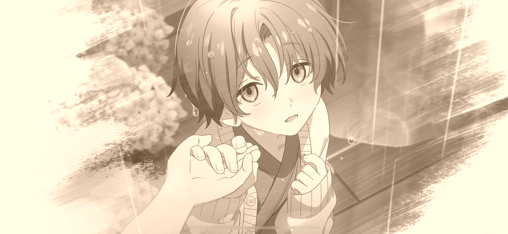

import "styles/series/18tr.scss";
import Bubble from "components/tl/Bubble";
import Location from "components/tl/Location.astro";

<Location name="Landmark Plaza - First Floor"/>

<Bubble character="Akuta" name="Boy with Headband">
But dude, if I could go all the way up to the observation floor like you did, I could get the sickest shots ever! Man, I can only dream!
</Bubble>

<Bubble character="MC">
You’ve never been to the Sky Garden?
</Bubble>

<Bubble character="Akuta" name="Boy with Headband">
Didn’t you hear? They do this crazy background check to make sure you’re rich enough for them before they let you in. No way a guy like me could get in there.
</Bubble>

<Bubble character="MC">
That’s insane…
</Bubble>

<Bubble character="Akuta" name="Boy with Headband">
You used to be able to get up there if you just paid 1,000 for a ticket! Man, I really wish I went back then!
</Bubble>

<Bubble character="MC">
Yeah… But when I was a kid, even 1,000 yen was a little out of the question for me, so we weren’t able to go up there by ourselves.
</Bubble>

<Bubble character="Akuta" name="Boy with Headband">
Seriously? That sucks, for real.
</Bubble>

<Bubble character="MC">
So we went somewhere else… I think we went to the top of some other building to see the HAMA port…

…Huh? Wait, where was that again…? I don’t remember…!

(Kafka might be there right now…)
</Bubble>

<Bubble character="Akuta" name="Boy with Headband">
……

Whatdja see out there?
</Bubble>

<Bubble character="MC">
Like… the view from that building?
</Bubble>

<Bubble character="Akuta" name="Boy with Headband">
Yeah. If you can remember anything you saw around that place, I might know where it is.
</Bubble>

<Bubble character="MC">
Wait, really?!
</Bubble>

<Bubble character="Akuta" name="Boy with Headband">
Yep! Y’know, I’m trying to be a galaxy-class movie director, so I know HAMA better than anyone else in the universe!
</Bubble>

<Bubble character="MC">
(He sure is exaggerating a lot…)

Thank you! I’ll tell you what I can remember, so I appreciate all the help I can get!
</Bubble>

<Bubble character="Akuta" name="Boy with Headband">
Okay! But I’m not gonna help you for free. You gotta be my camera operator for real next time, got it?
</Bubble>

<Bubble character="MC">
Ahaha… Well, as long as you don’t cause any trouble, I’ll be glad to help.
</Bubble>

<Bubble character="Akuta" name="Boy with Headband">
Aw, hell yeah! I’ll hold you to that!

So, you remember anything?
</Bubble>

<Bubble character="MC">
Uh, well… I’m pretty sure that building had a bento shop on the first floor…
</Bubble>

<Location name="HAMA Ward 3 Building (Past)"/>

<Bubble character="MC">
It’s so late…
</Bubble>

<Bubble character="Kafka">
……
</Bubble>

<Bubble character="MC">
Are you tired, Kafka?
</Bubble>

<Bubble character="Kafka">
…Yeah.
</Bubble>

<Bubble character="MC">
Huh? Are you okay?!

(I remember now… Kafka sat himself down in front of that building and didn’t want to move.)

Um, Kafka… Are you hungry? Do you wanna get a bento?
</Bubble>

<Bubble character="Kafka">
No…
</Bubble>

<Bubble character="MC">
Then, uh… do you want some water?
</Bubble>

<Bubble character="Kafka">
I’m okay.
</Bubble>

<Bubble character="MC">
Kafka…

(I didn’t know what to do, so I…)

(I took Kafka’s hand and led him up the stairs at the side of the building…)
</Bubble>

<Location name="HAMA Ward 3 Building (Present)"/>

<Bubble character="MC">
Ah… This is it. It still looks the same…

(I remember that Sakujiro-san was trying to track us down that entire day, and we didn’t find out until afterwards.)

(But in the end, Kafka and I were both able to go on our trip together. We learned how trips can change people’s lives… and we both grew to love HAMA.)

(I worked hard to make this travel guide just because I wanted to make someone smile. I wonder if my job as a tour guide ever made me feel that same way…)
</Bubble>

<Location name="HAMA Ward 3 Building - Staircase"/>

<Bubble character="MC">
Haha… These stairs are more narrow than I remember. They looked so much bigger to us as kids.

(I remember holding my travel guide in one hand like I am now, but that day, I was holding Kafka in my other. I really just…)

I just wanted to see Kafka smile.

(That feeling hasn’t changed, even now, I… No, maybe it’s the opposite now.)

(Those memories taught me that I want to live to make people smile. They made me who I am today. …Hey…)
</Bubble>

<Bubble character="MC">
…Kafka.
</Bubble>
