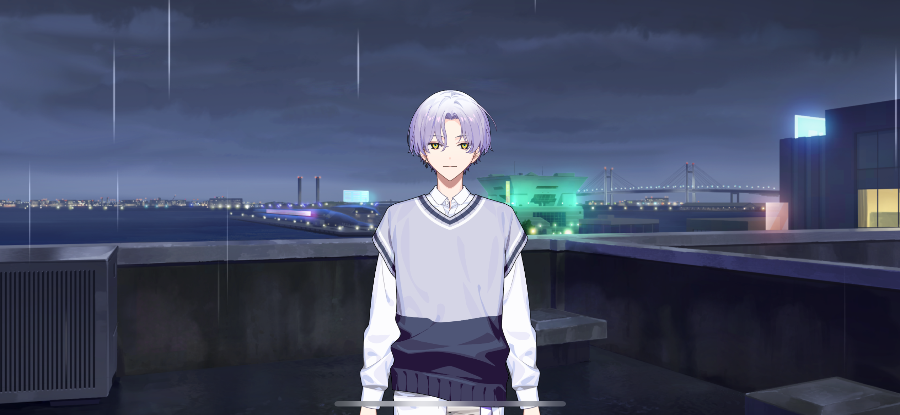
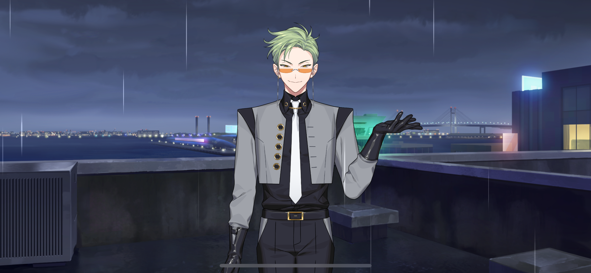
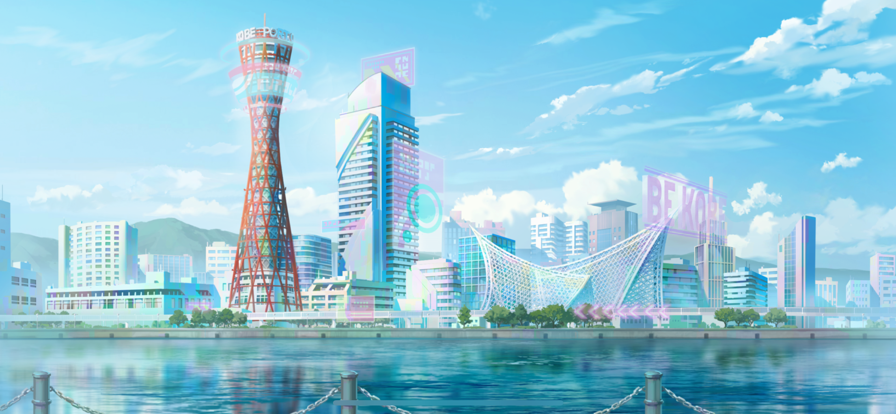
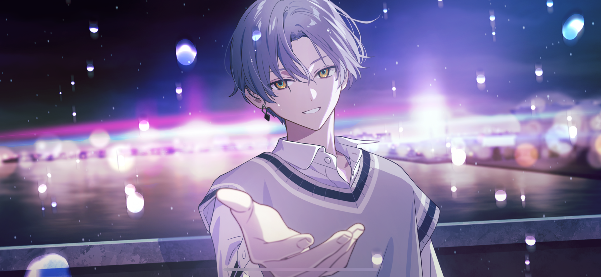
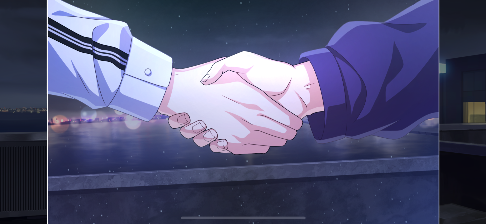

import "@/styles/series/18tr.scss";
import Bubble from "@/components/tl/chapter/Bubble/Bubble.astro";
import Location from "@/components/tl/chapter/Location.astro";
import Diff from "@/components/tl/chapter/Diff.astro";
import Name from "@/components/tl/chapter/Name.astro";

<Location name="HAMA Ward 3 Building - Rooftop"/>

<Bubble character="Kafka">
……
</Bubble>

<Bubble mc>
Kafka? Is somethi—
</Bubble>

(Pop)

<Bubble mc>
Hwuh?!
</Bubble>

<Bubble character="Kafka">
Congratulations, <Name first />-chan!
</Bubble>

<Bubble mc>
Wh… huh…?!
</Bubble>

<Bubble character="Kafka">
Consider yourself hired!
</Bubble>

<Bubble mc>
Uh… huh?
</Bubble>

(Applause)

<Bubble character="Sakujiro">
Congratulations. I expected you to take at least 5 more hours. I underestimated you, MC-san.
</Bubble>

<Bubble mc>
Sakujiro-san?! Wait, where did you… What…?

And what do you mean hired… Kafka, you run a company?
</Bubble>

<Bubble character="Kafka">
Hahaha… You look like you saw a ghost. Here, take a look.
</Bubble>

<Bubble mc>
What’s this…? Some kind of document?
</Bubble>

<Bubble character="Kafka">
Yeah. It’s the registration for the company I started.
</Bubble>

<Bubble mc>
Registration…? I don’t know if I understand… You started your own company…?

What’s a… mission statement?
</Bubble>

<Bubble character="Kafka">
Company philosophies, basically… A guideline of things we should put into action to reach our goals.
</Bubble>

<Bubble mc>
So, like… The things you want the company to do?
</Bubble>

<Bubble character="Kafka">
Exactly!
</Bubble>

<Bubble character="Kafka">
Do you remember the first time you went on a trip? What did you want to do, where did you go? Who did you go with?

All of those heart-racing experiences, the people you ran into… Maybe there were some unexpected bumps in the road, too.
</Bubble>

<Bubble character="Kafka">
But you can’t enjoy any of that unless you take your first step forward towards that journey.

Where should you go? What should you do? What should you bring? Who should you bring?
</Bubble>

<Bubble character="Kafka">
To all those with wanderlust in their hearts, and to all those who have yet to take their first journey… HAMA welcomes you.

Something that warms your heart the moment you think of it, something that gives you the courage to reach your hand out to grab it…
</Bubble>

<Bubble character="Kafka">
HAMA will love and support you every step of the way. We want to take you by the hand…

We are…
</Bubble>

<Bubble character="Kafka & MC">
“HAMA Tours.”
</Bubble>

<Bubble mc>
Kafka, this is…
</Bubble>

<Bubble character="Kafka">
<Name first />-chan.

You felt it when you walked around today, right? Everything’s changed so much since back then… HAMA is hurting right now.

I don’t want to be cooped up in the hospital and only listen to your stories of the outside world anymore.

I want to bet the rest of this life I have and renew HAMA. I need you to be with me for that. So…
</Bubble>

<Bubble character="Kafka">
Would you bet your life on me?
</Bubble>

<Bubble mc>
Kafka…

(No matter where I traveled, I felt that I was missing something. I wasn’t sure if I was really doing what I wanted to do, even though I knew I wanted to be in the tourism industry. Now I know why I felt that way…)

(I want to make visitors to HAMA smile. That’s really all I’ve ever wanted. I want to feel the same way I did back when I was with Kafka.)
</Bubble>

<Bubble mc>
…I will.

I’ll heal HAMA with you. I’ll bet my life on it, too!
</Bubble>

<Bubble character="Kafka">
…Really? You really will?
</Bubble>

<Bubble mc>
Of course.
</Bubble>

<Bubble character="Kafka">
You’re not doing it… out of pity, right? You don’t just want to help because you feel bad for me?
</Bubble>

<Bubble mc>
No! Nothing even close to that.

It’s been bothering me lately. HAMA used to be so lively, but seeing what it’s like now… I feel so powerless and upset.

But I couldn’t really do anything about it. So I think you’re amazing, Kafka!

Because of you, I finally have a way I can give back to HAMA. Nothing could make me happier!
</Bubble>

<Bubble character="Kafka">
Wow, you’re… You really…!

I guess I already won my biggest gamble.
</Bubble>

<Bubble mc>
Huh? What do you mean?
</Bubble>

<Bubble character="Kafka">
Oh, nothing.
</Bubble>

<Bubble character="Sakujiro">
……
</Bubble>

<Bubble mc>
So… What do we do first? Is there anything I can do right off the bat?
</Bubble>

<Bubble character="Kafka">
Look who’s rearing and ready to go. That’s what I like to see!
</Bubble>

<Bubble mc>
Well, yeah! Because…

(I think I’ve finally found what I want to do… And on top of that, Kafka and I are working towards the same thing.)

(I knew the instant I read the “HAMA Tours” mission statement. Kafka feels the same… That trip Kafka and I took still has a place in his heart!)

I’ll do anything, for real! When do we start… Oh, I should tell you. After next week I’ll be free to do whatever you need.

I’ll be kind of unemployed soon, so…
</Bubble>

<Bubble character="Kafka">
Yeah, I knew that.
</Bubble>

<Bubble mc>
What…? Did I tell you about my company going down?
</Bubble>

<Bubble character="Kafka">
Haha, who knows. What crazy luck, am I right?
</Bubble>

<Bubble character="Sakujiro">
Young Master Kafka, excuse me…

You will catch a cold.
</Bubble>

<Bubble character="Kafka">
……

I like the rain. It falls on everyone equally. And…

The freezing rain that’s been falling on me for a long time will finally end tomorrow.
</Bubble>

<Bubble mc>
Tomorrow? What’s tomorrow?
</Bubble>

<Bubble character="Kafka">
My surgery.
</Bubble>

<Bubble mc>
What…? Your… Your surgery?! But you told me on PeChat that they already did it…
</Bubble>

<Bubble character="Kafka">
Yeah, I lied.
</Bubble>

<Bubble mc>
What?! But, Sakujiro-san…
</Bubble>

<Bubble character="Sakujiro">
My deepest apologies. My 879th ability pertains to participating in emergency collusions.
</Bubble>

<Bubble mc>
You, too…?

Wait, I’m getting off track!

You’re getting operated on tomorrow, and you’re just out here in the rain…!

Wear this! Is there a towel anywhere… Ah, I have my handkerchief. You need to at least wipe yourself dry—
</Bubble>

<Bubble character="Kafka">
Ahaha! This is really bothering you, huh, <Name first />-chan?
</Bubble>

<Bubble mc>
Well, yeah! This isn’t funny, you know!
</Bubble>

<Bubble character="Kafka">
Come on, yes, it is.

I told you, I’ve already won my biggest gamble, so I’m practically invincible. It doesn’t matter what the success rate of the surgery is. I’ll make it out fine…

I won’t die on you.
</Bubble>

<Bubble mc>
I know, and I believe you, but… How are you so confident?
</Bubble>

<Bubble character="Kafka">
Because you gave me courage.
</Bubble>

<Bubble mc>
I did…?
</Bubble>

<Bubble character="Kafka">
I’m through with only being able to see the world you live in from outside a window.

I won’t let you leave me behind, and I won’t sit and wait for you either.

From now on, I plan to walk by your side.

I… I don’t think that everything will go perfectly. Even back then, we got lost and didn’t have enough money to go up to the observation deck.
</Bubble>

<Bubble mc>
Yeah, true… But, still…

All we had to do was look for somewhere else to go.

Even though we couldn’t go up to the deck, the view from this building is just as beautiful.
</Bubble>

<Bubble character="Kafka">
Yeah… It really is.

<Name first />-chan…

Let’s go on a journey together!
</Bubble>
